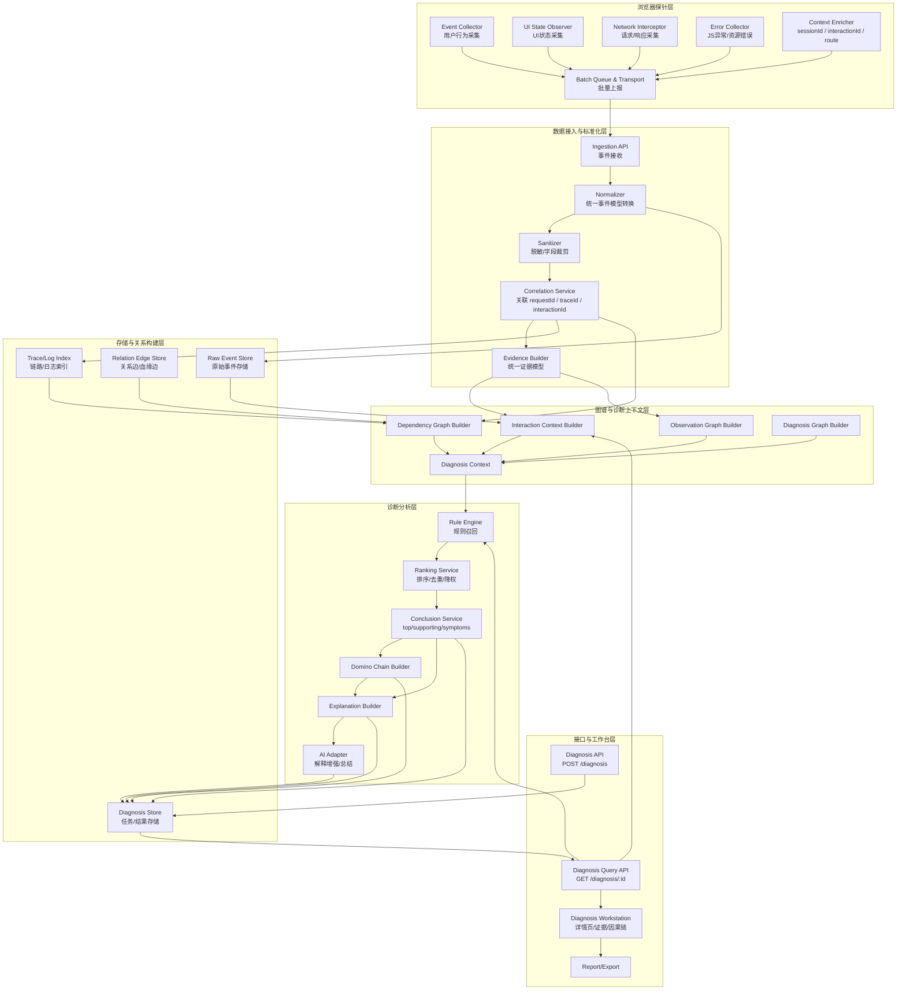
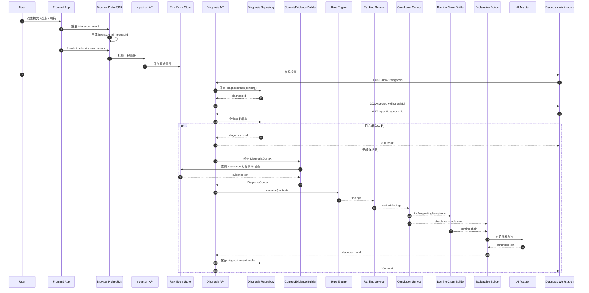
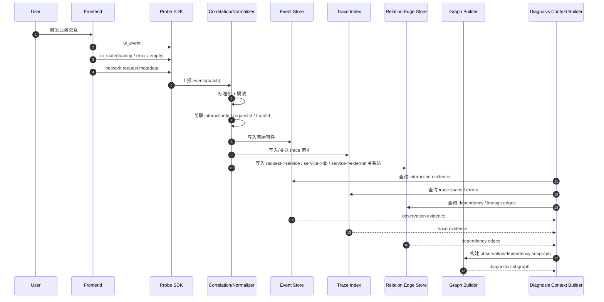
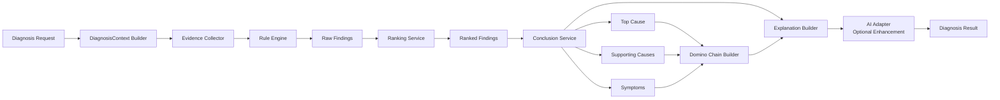

下面直接给你一版可放进架构文档的 **Mermaid 图**，包括：

1. 系统分层图  
2. 核心时序图  
3. 补一张可选的“诊断分析内部链路图”

你可以直接粘到 Markdown 文档里。

---

# 1. 系统分层图（Mermaid）

---

# 2. 核心时序图：一次交互触发诊断

这个图描述的是：

- 浏览器产生交互
- 探针上报
- 用户/系统发起诊断
- 后端 lazy execute
- 返回 diagnosis result

---

# 3. 核心时序图：前端交互到上下游因果链构建

这个图更强调你产品差异化的“因果链/血缘”主线。

---

# 4. 诊断分析内部链路图（Mermaid）

这张图适合放在 Diagnosis 模块设计章节里。

---

# 5. 可直接配套的图说明文案

你可以在文档里直接配下面这段简短说明。

---

## 5.1 系统分层图说明
系统从浏览器探针层采集用户交互、UI 状态、网络请求和错误事件，经数据接入与标准化层完成统一建模、脱敏与关联，再进入存储与关系构建层形成原始事件、关系边和链路索引。在此基础上，图谱与诊断上下文层围绕单次 interaction 构建 observation/dependency/diagnosis 子图，供诊断分析层完成规则召回、排序、归因总结、domino chain 生成与解释增强，最终通过 Diagnosis API 和工作台对外提供查询、展示与报告能力。

## 5.2 核心时序图说明
一次诊断流程以用户交互为起点，浏览器探针在前端侧采集交互和上下文事件并上报。诊断创建接口仅生成 diagnosis task，不同步执行完整分析；查询接口在命中缓存时直接返回结果，在未命中时基于 interaction 相关证据构建 DiagnosisContext，并按“规则召回 → 排序 → 归因总结 → 因果链生成 → 解释增强”的链路完成 lazy execute，再将结果缓存后返回。

## 5.3 诊断分析链路图说明
诊断分析链路以 DiagnosisContext 为统一输入，先由 Rule Engine 召回多个候选 finding，再由 Ranking Service 完成排序、去重和 symptom 降权，由 Conclusion Service 输出 top cause / supporting causes / symptoms，随后 Domino Chain Builder 将其组织为面向用户的因果链，Explanation Builder 生成可解释文本，AI Adapter 仅作为增强层，不直接替代规则与结论判断。

---

# 6. 一个小建议

如果你后面要把这份文档继续整理成正式方案，我建议图的顺序用：

1. **系统分层图**
2. **核心时序图：一次交互触发诊断**
3. **诊断分析内部链路图**

这个顺序最适合汇报，也最符合你现在“先讲整体，再讲主流程，再讲 Diagnosis 内核”的节奏。

如果你愿意，我下一条可以继续直接补：

**“数据模型 ER/关系设计图（Mermaid classDiagram / erDiagram 版）”**。