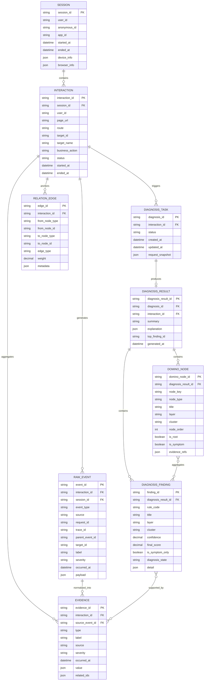
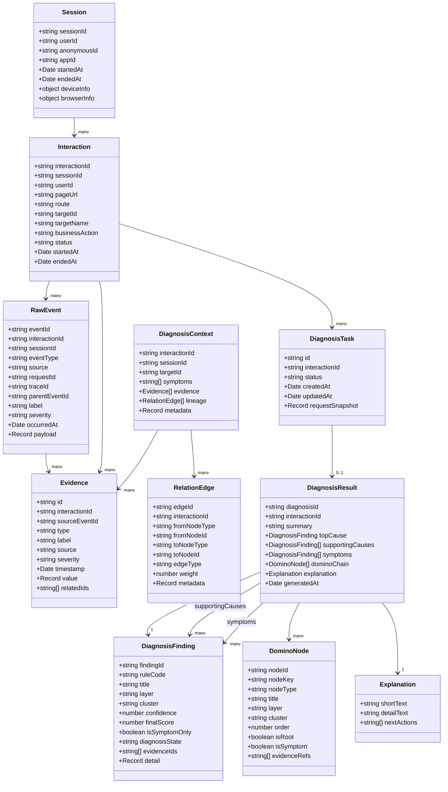
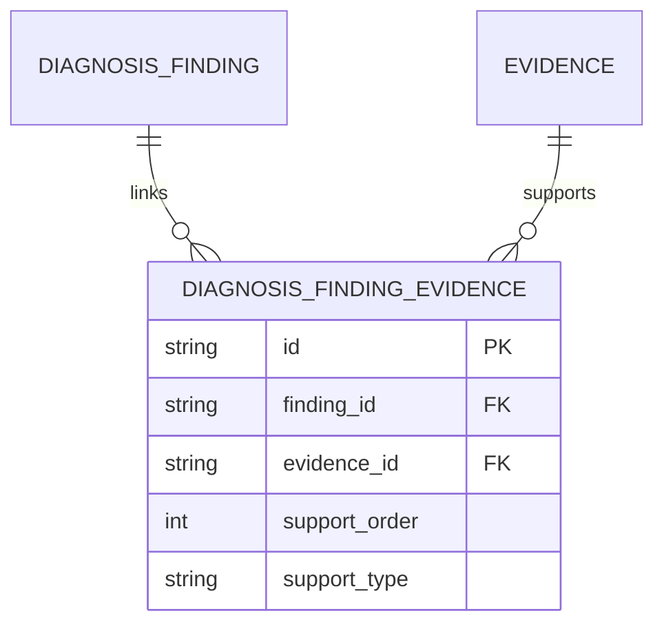
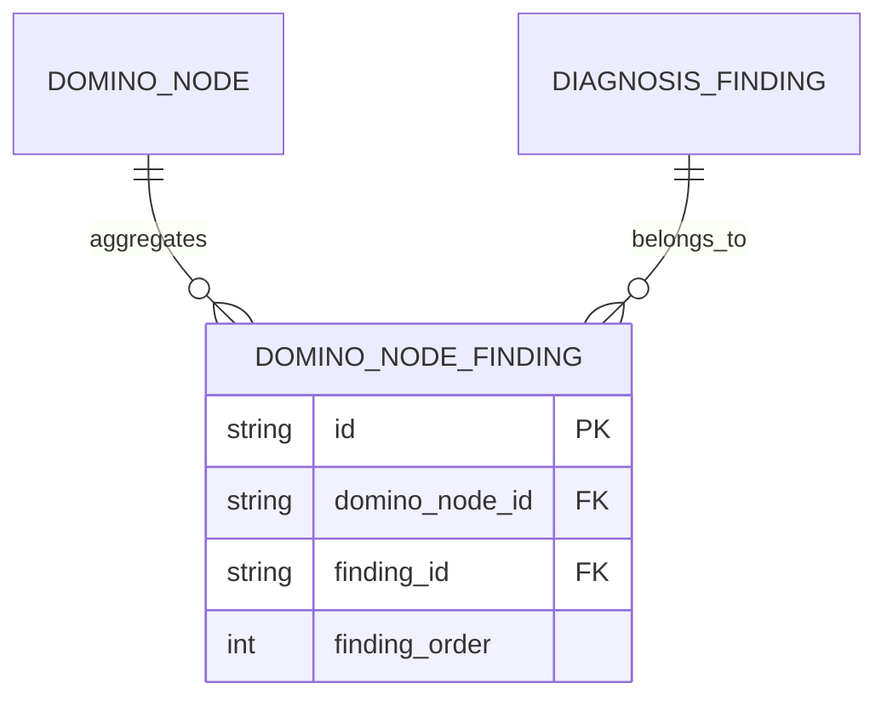

下面给你一版 **数据模型 ER / 关系设计图（Mermaid）**，我分成两张：

1. **业务/存储视角的 `erDiagram`**
2. **诊断对象视角的 `classDiagram`**

这样你文档里既能讲“库表关系”，也能讲“领域模型”。

---

# 1. 数据模型 ER 图（Mermaid `erDiagram`）

这版偏**落库存储设计**，围绕你当前 MVP 核心对象：

- Session
- Interaction
- RawEvent
- Evidence
- DiagnosisTask
- DiagnosisResult
- DiagnosisFinding
- DominoNode
- RelationEdge

---

# 2. 诊断对象模型图（Mermaid `classDiagram`）

这版偏**领域模型 / 应用层结构**，适合放在 Diagnosis 模块设计章节中。

---

# 3. 如果你要更贴近“库表落地”，建议拆成两层库表

为了避免后期表过于混杂，我建议在文档里明确分成：

---

## 3.1 观测层表
存前端/链路原始事实：

- `session`
- `interaction`
- `raw_event`
- `evidence`
- `relation_edge`

特点：
- 偏事实记录
- 写多
- 用于回溯和构造上下文

---

## 3.2 诊断层表
存诊断任务与结果：

- `diagnosis_task`
- `diagnosis_result`
- `diagnosis_finding`
- `domino_node`

特点：
- 偏诊断产物
- 读多
- 支撑工作台展示和缓存

---

# 4. 推荐补充的多对多关系表

如果你后面准备把 ER 再做细一点，我建议显式补两张关联表，而不是都塞 JSON。

---

## 4.1 `diagnosis_finding_evidence`
表示一个 finding 由哪些 evidence 支撑。

---

## 4.2 `domino_node_finding`
表示一个 domino node 聚合了哪些 findings。

这两张表很适合从 MVP 后期开始引入。  
如果你现在想先简单，也可以先存在 JSON 字段里。

---

# 5. 字段设计建议

下面是文档里值得明确写出来的几个字段原则。

---

## 5.1 ID 体系
统一使用字符串 ID，便于跨端关联：

- `sessionId`
- `interactionId`
- `eventId`
- `requestId`
- `traceId`
- `diagnosisId`
- `findingId`

---

## 5.2 时间字段
统一至少有：

- `createdAt`
- `updatedAt`
- `occurredAt`
- `generatedAt`

用于排序、诊断窗口裁剪、重放。

---

## 5.3 JSON 字段使用原则
建议只在这些场景用 JSON：

- 原始 payload 摘要
- 可变 detail
- metadata
- 解释文本结构
- 节点附加信息

不要把主查询字段都埋到 JSON 里。  
像这些字段最好结构化：

- `rule_code`
- `layer`
- `cluster`
- `status`
- `interaction_id`

---

# 6. 文档里可直接配的说明文字

你可以直接把下面这段放进设计文档。

---

## 6.1 数据模型设计说明
平台数据模型分为“观测层”和“诊断层”两类。观测层围绕 session、interaction、raw_event、evidence、relation_edge 建模，负责承载浏览器探针与链路追踪采集的原始事实及其关联关系；诊断层围绕 diagnosis_task、diagnosis_result、diagnosis_finding、domino_node 建模，负责承载一次诊断请求的任务状态、归因结果、症状输出和 domino chain 展示对象。

## 6.2 设计原则
数据模型以 interaction 为主锚点，以 evidence 为统一分析输入，以 diagnosis_result 为统一输出聚合对象。原始事件和诊断结果分层存储，避免观测事实与推断结论混杂；同时通过 relation_edge 与 finding-evidence 关联实现因果链与证据支撑能力。

## 6.3 MVP 落地策略
MVP 阶段优先保证 interaction、evidence、diagnosis_task、diagnosis_result 四类核心对象闭环可用；图谱关系可先通过 relation_edge 表和 JSON 边信息实现，不强依赖图数据库。待后续图查询和血缘分析复杂度提升后，再逐步引入更精细的关系表或图存储。

---

# 7. 我建议你文档里的最终摆放顺序

如果把前面的 Mermaid 图和这次的数据模型图放到同一份架构文档，我建议顺序是：

1. 系统分层图  
2. 核心时序图  
3. 诊断分析链路图  
4. 数据模型 ER 图  
5. 领域对象 classDiagram

这个顺序最自然。

如果你愿意，我下一条可以继续直接输出：

**“浏览器探针 SDK 技术设计草案（采集范围、事件协议、批量上报、性能与隐私边界）”**。