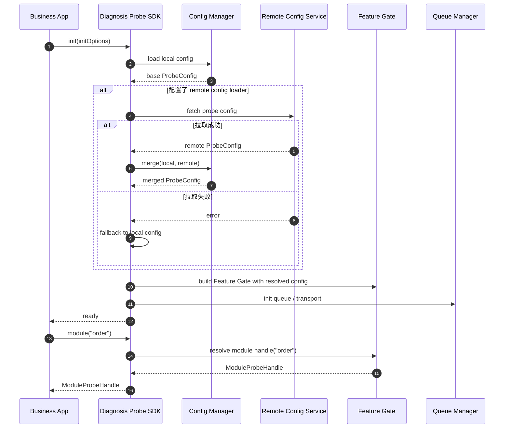
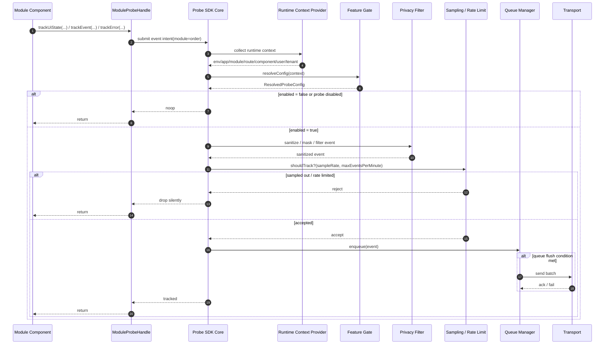
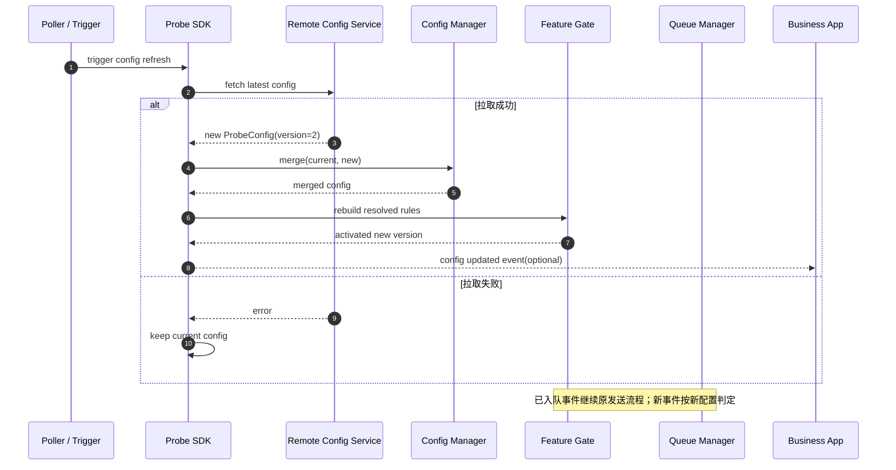
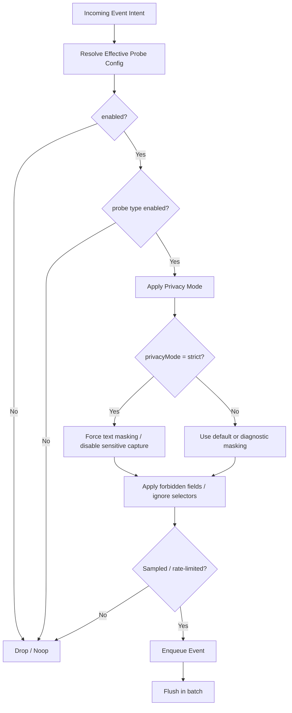

下面给你一版 **“模块级动态探针开关”的时序图 + 配置生效流程图（Mermaid版）**，可直接放进方案文档。

我给你 4 张图：

1. 初始化与配置加载时序图  
2. 模块内事件采集判定时序图  
3. 远程配置更新时序图  
4. 配置生效流程图  

---

# 1. 初始化与配置加载时序图

这张图表达：

- 业务应用启动
- SDK 初始化
- 加载本地默认配置
- 可选拉取远程配置
- 生成运行时 Feature Gate
- 业务模块后续通过 module handle 使用



---

# 2. 模块内事件采集判定时序图

这张图表达：

- 业务代码调用 `moduleProbe.track...`
- SDK 先合并上下文
- Feature Gate 判定是否启用
- 如果命中则进入隐私处理、采样、入队、上报
- 如果未命中则 no-op



---

# 3. 远程配置更新时序图

这张图表达：

- SDK 定时拉取或手动接收新配置
- 配置管理器完成合并
- Feature Gate 原子切换到新版本
- 新事件用新配置判定
- 已入队事件不受影响



---

# 4. 配置生效流程图

这张图更适合放在“配置解析规则”章节，说明配置如何从多层来源合并成最终生效配置。

```mermaid
flowchart TD
  A[Start resolveConfig(context)] --> B[Load Global Config]
  B --> C{Has Environment Config?}
  C -- Yes --> D[Merge Environment Layer]
  C -- No --> E[Skip]

  D --> F{Has App Config?}
  E --> F
  F -- Yes --> G[Merge App Layer]
  F -- No --> H[Skip]

  G --> I{Has Module Config?}
  H --> I
  I -- Yes --> J[Merge Module Layer]
  I -- No --> K[Skip]

  J --> L{Has Route Config?}
  K --> L
  L -- Yes --> M[Merge Route Layer]
  L -- No --> N[Skip]

  M --> O{Has Component Config?}
  N --> O
  O -- Yes --> P[Merge Component Layer]
  O -- No --> Q[Skip]

  P --> R{Matched Segment Rules?}
  Q --> R
  R -- Yes --> S[Apply Segment Overrides by Priority]
  R -- No --> T[Skip]

  S --> U[Apply Privacy Constraints]
  T --> U

  U --> V[Apply ProbeType Overrides]
  V --> W[Apply SampleRate / RateLimit Policy]
  W --> X[Build ResolvedProbeConfig]
  X --> Y[Return Effective Config]
```

---

# 5. 可选：更强调“隐私优先”的配置决策图

如果你想在文档里强调“隐私约束高于增强探针”，可以加这张。



---

# 6. 文档里可直接配的说明文字

你可以直接把下面这段放在图下方。

---

## 6.1 初始化与配置加载说明
模块级动态探针开关在 SDK 初始化阶段完成本地配置加载，并可选拉取远程配置。SDK 对多来源配置进行合并后构建运行时 Feature Gate，业务模块通过 `module()` 获取探针句柄，后续所有采集行为都由 Feature Gate 决定是否生效。

## 6.2 事件采集判定说明
业务模块调用探针句柄的 `trackEvent`、`trackUiState`、`trackError` 等 API 时，SDK 会先收集运行时上下文并解析生效配置，再依次执行启用判定、隐私过滤、采样与限流、队列入列和批量发送。若配置关闭或未命中采样，SDK 以 no-op 或静默丢弃方式处理，不影响业务逻辑。

## 6.3 配置更新说明
探针配置支持在运行时通过远程下发更新。更新流程采用“拉取 → 合并 → 原子替换 Feature Gate”的方式，新事件按新配置生效，已进入发送队列的事件保持原发送流程，以保证稳定性和可预测性。

## 6.4 配置生效规则说明
探针配置按“全局 → 环境 → 应用 → 模块 → 路由 → 组件 → 分群”的优先级逐层覆盖，最终再叠加隐私约束、采样率和限流策略，生成单次事件判定所使用的 `ResolvedProbeConfig`。隐私策略优先于增强采集策略，任何动态配置均不得突破敏感字段禁采边界。

---

# 7. 我建议你文档里的摆放顺序

如果这是“模块级动态探针开关”章节，我建议顺序是：

1. **配置生效流程图**
2. **初始化与配置加载时序图**
3. **模块内事件采集判定时序图**
4. **远程配置更新时序图**
5. 可选：**隐私优先决策图**

这样阅读路径更顺。

如果你愿意，我下一条可以继续直接补：

**“SDK 配置模型 + API 设计”的 TypeScript 接口草案（可直接放技术设计文档）**。