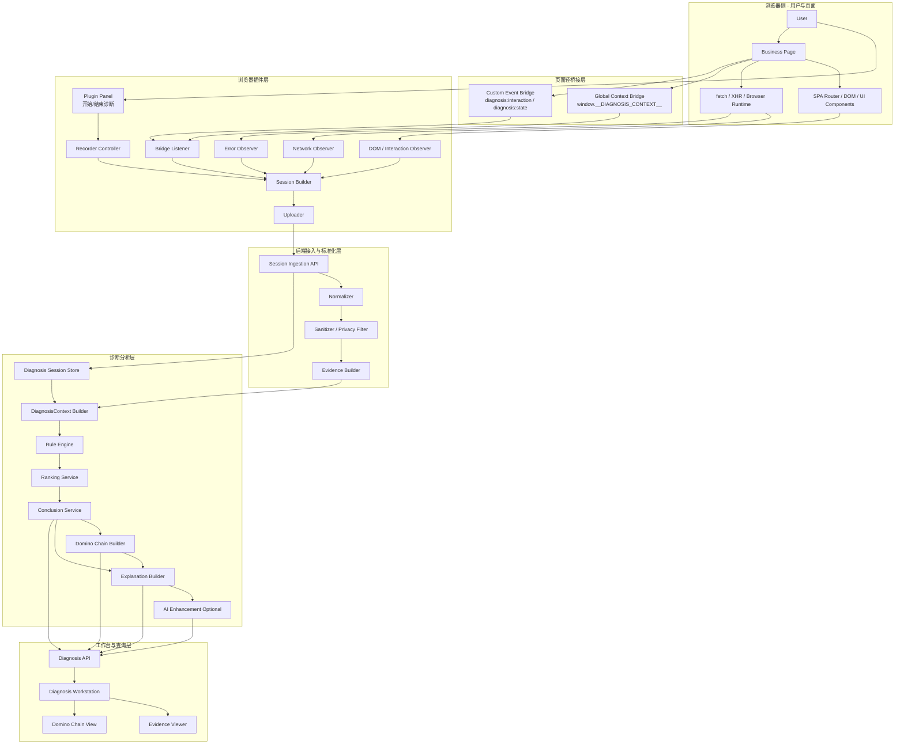
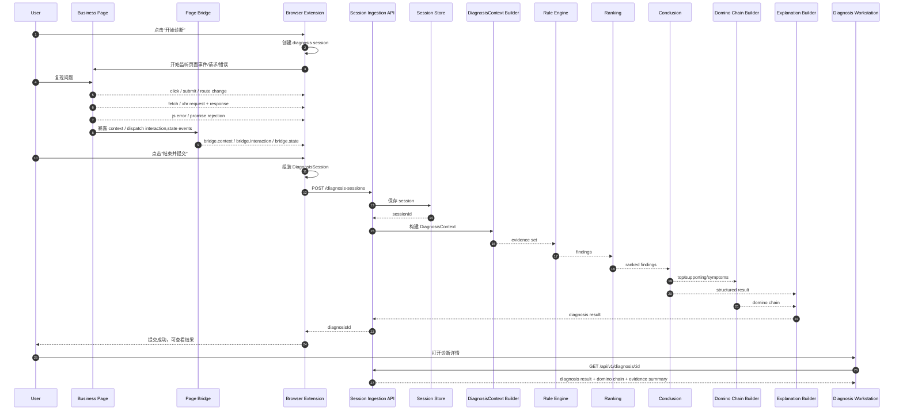
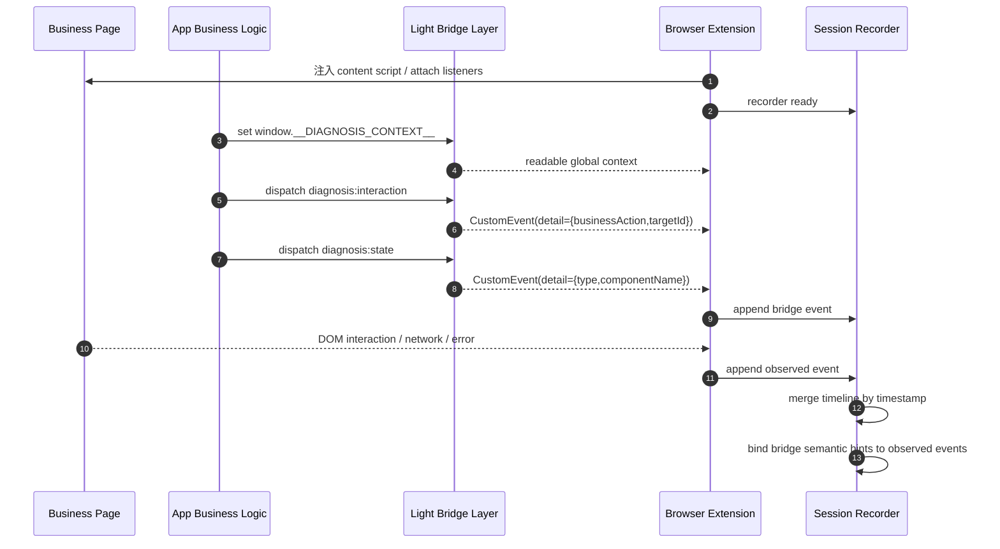
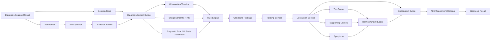

下面直接给你一版 **“浏览器插件 + 页面轻桥接协议”方案的系统分层图 + 核心时序图（Mermaid 版）**。  
我按 MVP 视角来画，尽量突出：

- 低侵入
- 插件为主
- 页面轻桥接补语义
- 后端做诊断分析
- 工作台承接结果展示

我给你 4 张图：

1. 系统分层图  
2. 核心时序图：一次诊断会话  
3. 页面桥接与插件协同时序图  
4. 后端诊断分析链路图  

---

# 1. 系统分层图（Mermaid）

---

# 2. 核心时序图：一次诊断会话（Mermaid）

这张图描述：

- 用户手动开始诊断
- 插件采集页面行为、请求、错误
- 页面通过轻桥接补充业务语义
- 插件结束录制并提交
- 后端分析并返回 diagnosis result

---

# 3. 页面桥接与插件协同时序图（Mermaid）

这张图更强调你关心的“插件 + 轻桥接协议”协作方式。

---

# 4. 后端诊断分析链路图（Mermaid）

这张图可以直接放到 Diagnosis 后端架构章节，强调插件 session 进入后端后的分析流程。

---

# 5. 可直接配在文档里的说明文字

下面这段你可以直接放在图下面。

---

## 5.1 系统分层图说明
该方案采用“浏览器插件主采集 + 页面轻桥接补语义 + 后端诊断服务分析”的分层架构。浏览器插件负责从页面外部观察交互、请求、异常等事实信号，页面轻桥接层以全局上下文对象和自定义事件形式补充必要业务语义，后端对诊断会话进行标准化、证据构建、规则分析、归因总结和 domino chain 生成，最终由工作台提供诊断结果展示和证据查看能力。

## 5.2 核心时序图说明
一次诊断以用户手动开始录制为起点，插件在会话期间记录页面交互、网络请求、异常和桥接事件。结束录制后，插件将完整 DiagnosisSession 上传到后端，后端基于统一 Evidence 模型构建 DiagnosisContext，并按“规则召回 → 排序 → 归因总结 → domino chain → explanation”的链路产出诊断结果。该流程避免了对业务系统的重度侵入，适合 MVP 阶段快速验证。

## 5.3 桥接协同说明
页面轻桥接协议负责补充插件难以稳定获取的业务语义，例如当前模块、businessAction 和关键业务状态。插件作为外部观察者，一方面收集黑盒可见事实，另一方面监听桥接层发出的上下文与语义事件，并在会话构建阶段将两类信息按时间轴合并，从而提升后端根因分析的可解释性和准确性。

## 5.4 后端分析链路说明
后端不直接依赖页面内部实现细节，而是以插件上传的 session 为统一输入，经标准化和脱敏后构造成 Evidence 集合，再结合桥接语义提示与请求/错误/UI 状态关联关系进行规则命中与排序。最终输出 top cause、supporting causes、symptoms 和 domino chain，使诊断结果既具可计算性，也具可展示性。

---

# 6. 我建议你文档里的摆放顺序

如果这是正式方案文档中的一个章节，建议顺序：

1. **系统分层图**
2. **核心时序图：一次诊断会话**
3. **页面桥接与插件协同时序图**
4. **后端诊断分析链路图**

这样从整体到流程再到细部，最顺。

如果你愿意，我下一条可以继续补：

**“浏览器插件 + 页面轻桥接协议”方案的数据模型设计图（Mermaid erDiagram / classDiagram 版）**。