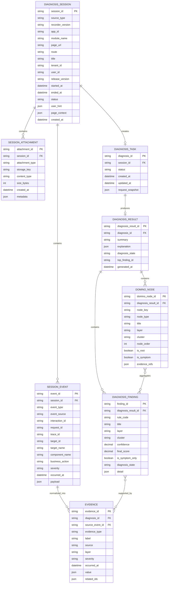
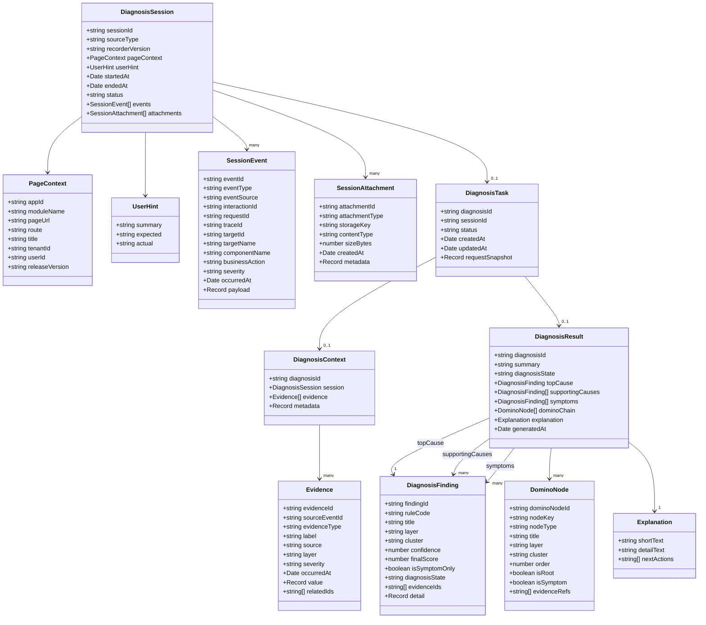
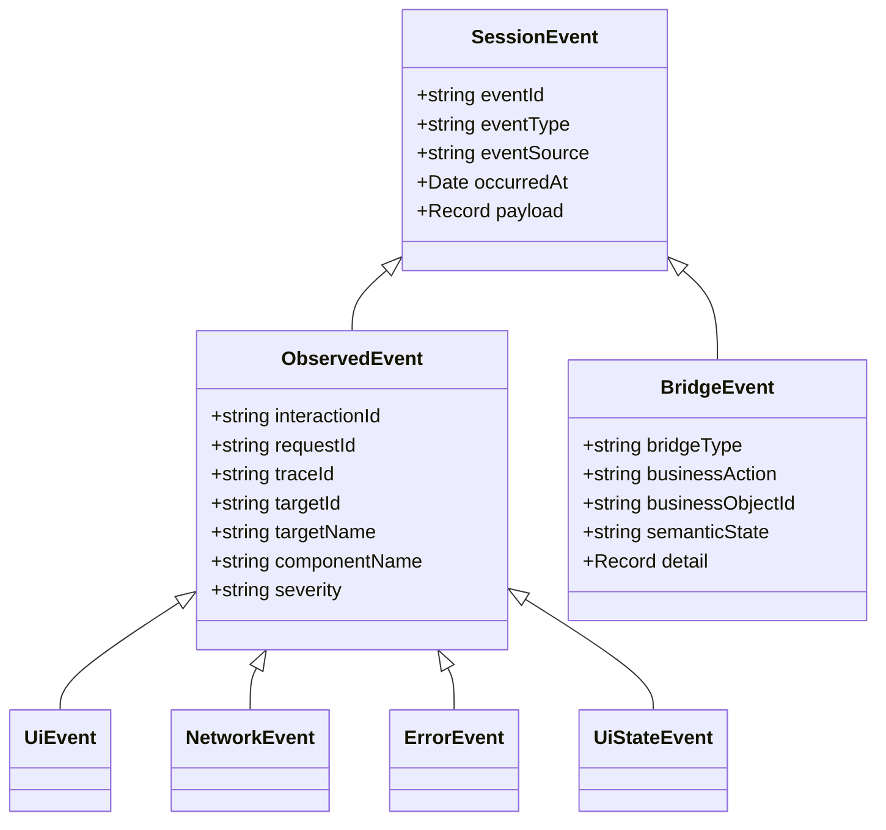
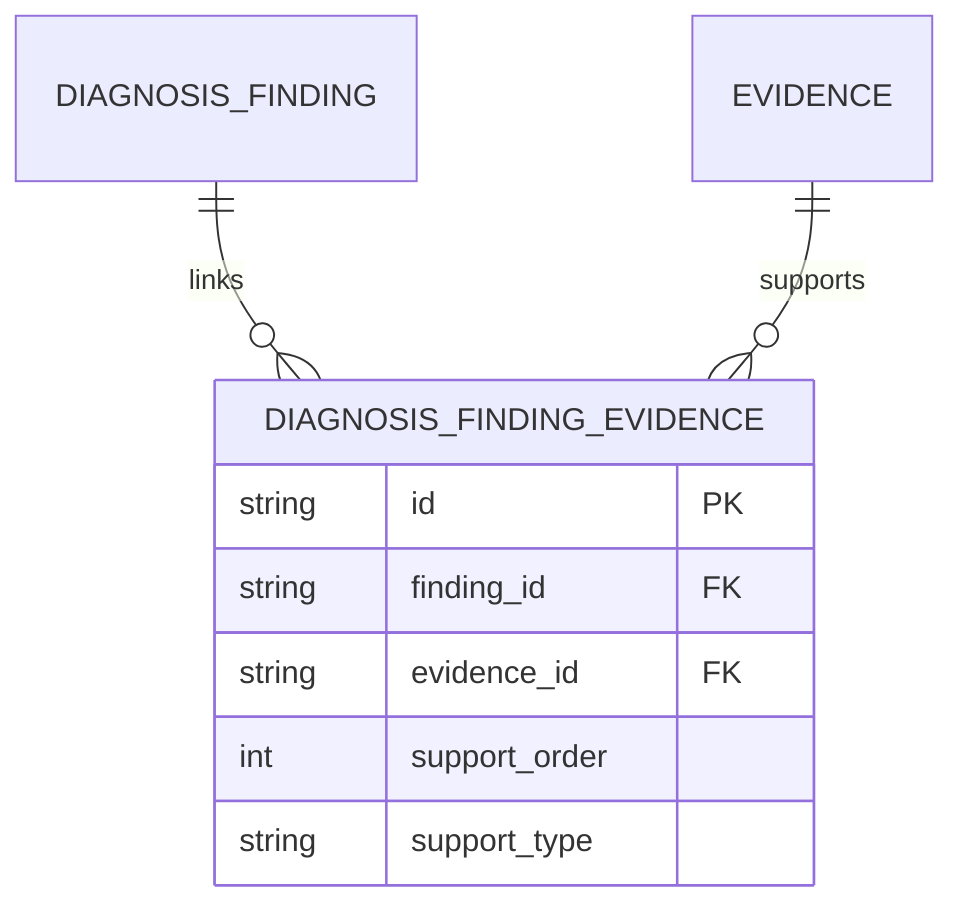
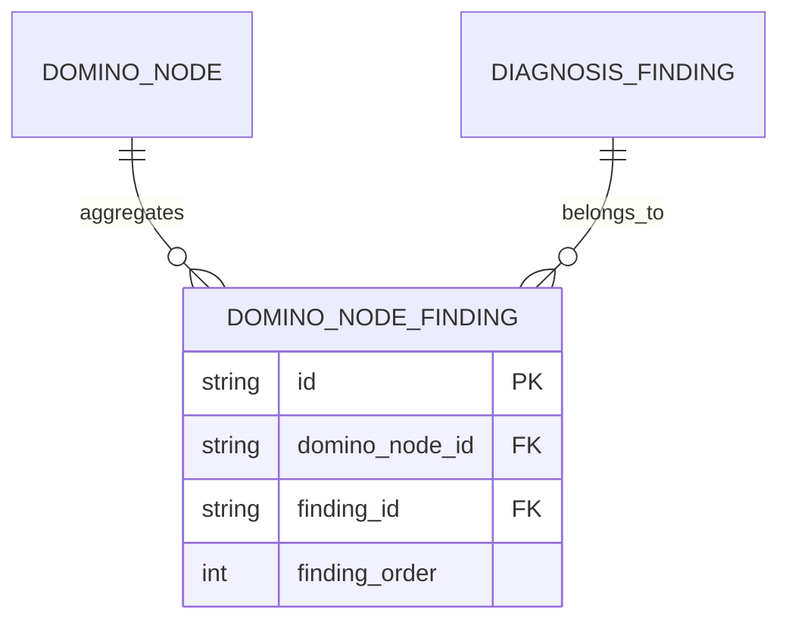

下面给你一版 **“浏览器插件 + 页面轻桥接协议”方案的数据模型设计图**，分成两张：

1. **ER 图**：偏存储/库表关系
2. **classDiagram**：偏领域模型/应用对象

我会围绕这条链来建模：

- 浏览器插件录制一次 `DiagnosisSession`
- 会话里包含插件观察事件 + 页面桥接事件
- 后端标准化成 `Evidence`
- 基于 Evidence 生成 `DiagnosisResult`

---

# 1. 数据模型 ER 图（Mermaid `erDiagram`）

这版适合放在“后端存储设计 / 数据落地设计”章节。

---

# 2. 诊断对象模型图（Mermaid `classDiagram`）

这版适合放在“应用层 / 领域建模”章节，表达插件方案下的核心对象关系。

---

# 3. 如果你想更突出“插件事件 + 桥接事件”的区别，可以再补一张子模型图

这张图很适合说明：  
你的 session event 其实来自两类来源：

- 插件自动观测
- 页面轻桥接补充

---

# 4. 推荐的数据分层

如果你要把文档写得更工程化，建议把数据模型分成三层理解。

---

## 4.1 录制层
插件提交的原始诊断会话：

- `diagnosis_session`
- `session_event`
- `session_attachment`

这层强调“原始事实”和“问题复现场景”。

---

## 4.2 分析层
后端标准化与上下文构建：

- `diagnosis_task`
- `evidence`

这层强调“把录制内容转成可计算输入”。

---

## 4.3 结果层
最终面向工作台消费：

- `diagnosis_result`
- `diagnosis_finding`
- `domino_node`

这层强调“归因输出”和“可解释展示”。

---

# 5. 建议补的两个关联表

如果后面你想从 MVP 往更规范的落库走，我建议再显式加两张关联表。

---

## 5.1 `diagnosis_finding_evidence`
表示 finding 由哪些 evidence 支撑。

---

## 5.2 `domino_node_finding`
表示 domino node 聚合了哪些 finding。

MVP 阶段可以先不单独建表，先放 JSON；  
后面如果工作台需要更细粒度 drill-down，再拆出来。

---

# 6. 字段设计建议

## 6.1 `event_source`
建议显式区分来源：

- `plugin.dom`
- `plugin.network`
- `plugin.error`
- `plugin.ui_state`
- `bridge.context`
- `bridge.interaction`
- `bridge.state`
- `user.manual`

这样后端规则会更好写。

---

## 6.2 `event_type`
建议统一命名，例如：

- `ui.click`
- `ui.submit`
- `ui.route_change`
- `network.request`
- `network.response`
- `network.error`
- `error.js`
- `error.promise`
- `state.loading`
- `state.toast`
- `bridge.context`
- `bridge.interaction`
- `bridge.state`

---

## 6.3 `layer`
在 Evidence / Finding 上建议保留层次字段：

- `user_action`
- `frontend_app`
- `ui_state`
- `api`
- `bff`
- `db`
- `external`

即使插件方案里后端早期未必拿得到全部层，也建议模型先预留。

---

# 7. 文档里可直接配的说明文字

你可以直接把下面这段放进技术方案。

---

## 7.1 数据模型设计说明
“浏览器插件 + 页面轻桥接协议”方案的数据模型分为三层：录制层、分析层和结果层。录制层用于承载插件在一次诊断会话中采集到的原始事件、桥接事件和附件；分析层用于将会话标准化为 Evidence 并构建 DiagnosisContext；结果层用于承载规则分析、归因结论和 domino chain 等工作台消费对象。

## 7.2 设计原则
该模型以 `DiagnosisSession` 为问题复现锚点，以 `SessionEvent` 为统一事实载体，以 `Evidence` 为诊断分析输入，以 `DiagnosisResult` 为统一输出对象。模型同时保留 `event_source` 和 `event_type` 两个维度，用于区分插件自动观测与页面桥接补充的来源差异，从而提高后端规则命中与解释输出的稳定性。

## 7.3 MVP 落地策略
MVP 阶段优先保证 `diagnosis_session → session_event → evidence → diagnosis_result` 这条主链闭环可用，finding 与 evidence、domino node 与 finding 的细粒度关系可先通过 JSON 字段表达，待工作台 drill-down 需求明确后再演进为独立关联表。

---

# 8. 我建议你文档里的摆放方式

如果这是“插件 + 轻桥接”章节的数据模型部分，建议顺序：

1. **ER 图**
2. **classDiagram**
3. 可选：**插件事件 / 桥接事件子模型图**
4. 数据分层说明
5. MVP 落地策略

这样最清晰。

如果你愿意，我下一条可以继续直接补：

**“浏览器插件 + 页面轻桥接协议”方案的后端 API 设计草案（session 上传 / diagnosis 查询 / 工作台查询）**。