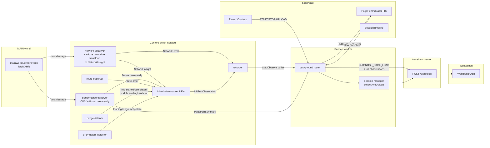
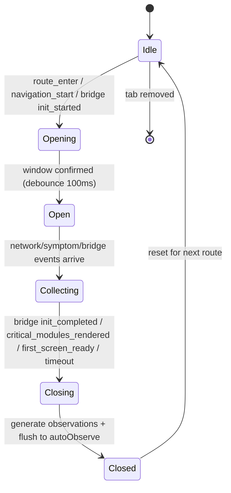
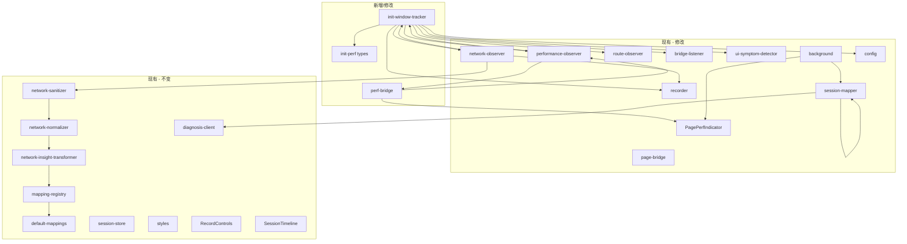

# 页面初始化接口性能排查 + 诊断流程完善 — 设计规格

> 日期：2026-06-30
> 项目：TraceLens 浏览器插件（extension-app）
> 范围：仅插件侧；后端新增初始化性能规则（R1–R7）作为后续工作标注
> 参考文档：`97-性能监测.md`（页面初始化接口性能诊断 Plan）、`96-dd.md`（network-timeline-builder 骨架）

---

## 0. 设计目标

基于现有浏览器插件 `extension-app`，设计并完善两个主要功能：

| 功能 | 名称 | 触发方式 | 范围 |
|------|------|----------|------|
| **A** | 页面初始化接口性能排查 | 自动检测慢 → 提示一键诊断 | Phase 1 + Phase 2 |
| **B** | 手动录制诊断流程（原有） | 用户手动开始/停止/提交 | 修复死链 + 补全体验 |

两个功能共享同一套观察者基础设施（content script observers），但走**不同 buffer + 不同触发链路**。

---

## 1. 架构总览与数据流

### 1.1 核心思路

- **功能A**：始终开启的 `autoObserve` buffer；新建 `init-window-tracker` 产出 `InitPerfObservation[]`；自动检测初始化慢 → SidePanel 提示"一键诊断"→ 复用 `DIAGNOSE_PAGE_LOAD` 路径提交。
- **功能B**：手动 `buffer`；start → capture → stop → submit → workbench（打通 `PERF_UPDATE` 死链 + 修复未渲染组件）。

两个功能在采集层共享：`network-observer`、`performance-observer`、`route-observer`、`bridge-listener`、`ui-symptom-detector`。差异在于**谁来消费、写入哪个 buffer、何时提交**。

### 1.2 数据流图



### 1.3 新增/修改文件清单

| 文件 | 动作 | 职责 |
|------|------|------|
| `content/init-window-tracker.ts` | **新增** | 初始化窗口管理 + observation 生成 |
| `content/perf-bridge.ts` | **新增** | 桥接 PerformanceEvent → PagePerfSummary → PERF_UPDATE 消息 |
| `shared/types/init-perf.ts` | **新增** | InitWindow、InitPerfObservation、CriticalModuleState 等类型 |
| `content/performance-observer.ts` | **修改** | first-screen-ready 时通知 init-window-tracker；产出 PagePerfSummary |
| `content/network-observer.ts` | **修改** | NetworkInsight 同时通知 init-window-tracker；autoObserve 写入 |
| `content/recorder.ts` | **修改** | autoObserve buffer 接受 init observation 与 network event |
| `background/index.ts` | **修改** | DIAGNOSE_PAGE_LOAD 路径携带 init observations |
| `background/session-mapper.ts` | **修改** | init observation → EvidenceItemDto 映射 |
| `sidepanel/components/PagePerfIndicator.tsx` | **修改** | 修复死链；增加"一键排查"提示 |
| `shared/types/probe-event.ts` | **修改** | PerformanceEvent.perfType 扩展为联合类型 |
| `shared/types/runtime-message.ts` | **修改** | DIAGNOSE_PAGE_LOAD 携带 init observations |
| `shared/constants/config.ts` | **修改** | 新增 init-window 阈值 |
| `page-bridge/index.ts` | **修改** | 增加 init/critical-module 语义事件辅助方法 |

---

## 2. 功能A：页面初始化接口性能排查

### 2.1 模块设计：`init-window-tracker.ts`

#### 2.1.1 职责

`init-window-tracker` 是一个单例模块，职责边界：

**负责**：
- 识别初始化窗口（开始点 / 结束点）
- 收集窗口内的 NetworkInsight（复用 network-observer 管线，带业务语义）
- 收集窗口内的关键模块状态（Phase 2，来自 bridge-listener）
- 收集窗口内的页面症状（来自 ui-symptom-detector）
- 生成 `InitPerfObservation[]`
- 将 observation 写入 recorder 的 autoObserve buffer

**不负责**：
- 网络事件原始采集（由 network-observer 负责）
- Core Web Vitals 采集（由 performance-observer 负责）
- 最终归因结论（由后端规则引擎负责）
- UI 展示（由 SidePanel 负责）

#### 2.1.2 初始化窗口定义

**开始点**（满足其一即开窗）：
1. `route-observer` 检测到 route enter（`history.pushState`/`replaceState`/`popstate`）
2. `bridge-listener` 收到 `init_started` 事件
3. 页面首次加载（`performance-observer` 检测到 navigation timing `navigationStart`）

优先级：bridge `init_started` > route enter > navigation start。若 bridge 已发 `init_started`，则以此为准；否则以 route enter 兜底。

**结束点**（优先级从高到低）：
1. bridge 发出 `init_completed`
2. 首屏关键模块全部 `rendered`（Phase 2）
3. `performance-observer` 的 first-screen-ready（稳定间隙检测 200ms 无 DOM 变化）
4. 超时自动截断（默认 15s，可配置 `RECORDER_CONFIG.initWindowMaxMs`）

#### 2.1.3 窗口内数据收集

窗口开启后，`init-window-tracker` 订阅以下数据源：

| 数据源 | 订阅内容 | 用途 |
|--------|----------|------|
| `network-observer` | NetworkInsight（仅窗口开启期间） | 接口耗时、串行依赖、失败检测 |
| `bridge-listener` | `init_started` / `init_completed` / `module loading` / `module rendered` | 窗口边界 + 关键模块跟踪（Phase 2） |
| `ui-symptom-detector` | loading-long / empty-state / error-toast | 页面症状关联 |
| `performance-observer` | first-screen-ready / Core Web Vitals | 窗口结束兜底 + 性能指标 |

**关键设计**：`network-observer` 在收到 NetworkInsight 后，同时做两件事：
1. 写入 recorder buffer（供功能B手动录制使用，现有逻辑）
2. **通知 `init-window-tracker`**（若 init 窗口处于开启状态）

`init-window-tracker` 收到 NetworkInsight 后，**不重新采集**，而是引用同一 NetworkInsight 对象，附加窗口内序号和时间偏移，存入自己的窗口内集合。这避免双轨采集问题。

#### 2.1.4 InitPerfObservation 类型定义

基于 `97-性能监测.md` §10，定义 observation 联合类型：

```ts
export type InitPerfObservation =
  | {
      type: 'init_window_started';
      page: string;
      timestamp: number;
      trigger: 'bridge' | 'route_enter' | 'navigation';
    }
  | {
      type: 'init_window_completed';
      page: string;
      startedAt: number;
      completedAt: number;
      durationMs: number;
      endReason: 'bridge_init_completed' | 'critical_modules_rendered' | 'first_screen_ready' | 'timeout';
    }
  | {
      type: 'critical_request_slow';
      requestId: string;
      module?: string;
      actionLabel: string;
      urlPattern: string;
      durationMs: number;
      threshold: number;
    }
  | {
      type: 'critical_request_failed';
      requestId: string;
      module?: string;
      actionLabel: string;
      status?: number;
      errorMessage?: string;
    }
  | {
      type: 'init_serial_dependency_detected';
      chainRequestIds: string[];
      chainActionLabels: string[];
      totalDurationMs: number;
      sumDurationMs: number;
    }
  | {
      type: 'frontend_settle_gap_large';
      gapMs: number;
      module?: string;
      lastCriticalRequestEndAt: number;
      firstCriticalModuleRenderedAt?: number;
      finalCriticalModuleRenderedAt?: number;
    }
  | {
      type: 'critical_module_not_rendered_after_request';
      module: string;
      requestId: string;
      requestEndedAt: number;
      observedAt: number;
      delayMs: number;
    }
  | {
      type: 'loading_too_long';
      module?: string;
      durationMs: number;
      threshold: number;
    }
  | {
      type: 'duplicate_request_in_init';
      urlPattern: string;
      requestIds: string[];
      count: number;
      windowMs: number;
    }
  | {
      type: 'init_symptom';
      symptom: 'empty_state' | 'error_toast' | 'blank_screen' | 'skeleton_too_long';
      module?: string;
      timestamp: number;
      detail?: string;
    };
```

#### 2.1.5 规则映射（Phase 1 + Phase 2）

| 规则 | Phase | observation type | 判定逻辑（插件侧） |
|------|-------|------------------|---------------------|
| R1 单关键接口超时/超慢 | P1 | `critical_request_slow` | duration > slowThreshold 且关键模块长期 loading |
| R2 多接口并发慢 | P1 | `critical_request_slow`（多条） | 窗口内多个接口 duration 均超阈值 |
| R3 串行依赖拉长初始化 | P2 | `init_serial_dependency_detected` | 后续请求起点晚于前序请求终点，总耗时接近各请求之和 |
| R4 非关键接口阻塞关键模块 | P2 | `critical_module_not_rendered_after_request` | 非关键模块接口完成后，关键模块仍 long loading |
| R5 接口成功但渲染延迟过长 | P2 | `frontend_settle_gap_large` | 最后关键请求完成 → 关键模块 rendered 间隔 > gapThreshold（1.5s） |
| R6 接口失败导致初始化不完整 | P1 | `critical_request_failed` + `init_symptom` | 关键请求失败/超时 + 出现 error/empty symptom |
| R7 重复请求/重试 | P2 | `duplicate_request_in_init` | 同一 urlPattern 窗口内短时间多次触发 |

**Phase 1（无桥接）**：R1、R2、R6 的基础版——无关键模块标记时，将窗口内所有接口视为"候选关键接口"，结合 ui-symptom-detector 的 loading-long 做"慢接口 + 症状"关联。

**Phase 2（有桥接）**：R3、R4、R5、R7 全量——依赖 bridge 的 `module loading/rendered` + `isCritical` 标记。

#### 2.1.6 InitWindow 数据结构

```ts
export interface InitWindow {
  windowId: string;
  page: string;
  route?: string;
  startedAt: number;
  completedAt?: number;
  endReason?: 'bridge_init_completed' | 'critical_modules_rendered' | 'first_screen_ready' | 'timeout';
  trigger: 'bridge' | 'route_enter' | 'navigation';
  networkInsights: WindowedNetworkInsight[];
  criticalModules: CriticalModuleState[];
  symptoms: InitSymptomRecord[];
  observations: InitPerfObservation[];
  pagePerf?: PagePerfSummary;
}

export interface WindowedNetworkInsight {
  insight: NetworkInsight;
  sequenceInWindow: number;
  offsetFromWindowStartMs: number;
  isCritical: boolean;
}

export interface CriticalModuleState {
  module: string;
  isCritical: boolean;
  loadingStartedAt?: number;
  renderedAt?: number;
  itemCount?: number;
  associatedRequestIds: string[];
}

export interface InitSymptomRecord {
  symptom: 'empty_state' | 'error_toast' | 'blank_screen' | 'skeleton_too_long';
  module?: string;
  timestamp: number;
  detail?: string;
}
```

#### 2.1.7 窗口生命周期状态机



### 2.2 打通 PERF_UPDATE 死链

#### 2.2.1 问题

`performance-observer.ts` 检测到 first-screen-ready 后，只调用 `recorder.appendAutoObserve(PerformanceEvent)`。**从不发送 `PERF_UPDATE` 消息**。导致 `PagePerfIndicator.tsx` 永远停在 "Measuring page load..."。

#### 2.2.2 修复方案

新增 `content/perf-bridge.ts`：

```ts
// perf-bridge.ts — 桥接 PerformanceEvent → PagePerfSummary → PERF_UPDATE

import type { PerformanceEvent, PagePerfSummary } from '../shared/types';
import { RECORDER_CONFIG } from '../shared/constants';

export function buildPagePerfSummary(event: PerformanceEvent): PagePerfSummary {
  const t = event.timing;
  const observations = event.observations ?? [];
  const isSlow =
    (t.lcp != null && t.lcp > RECORDER_CONFIG.SLOW_LCP_MS) ||
    (t.fcp != null && t.fcp > RECORDER_CONFIG.SLOW_FCP_MS) ||
    (t.ttfb != null && t.ttfb > RECORDER_CONFIG.SLOW_TTFB_MS) ||
    observations.includes('slow_api');

  return {
    pageReadyMs: t.firstScreenReadyMs,
    lcpMs: t.lcp,
    fcpMs: t.fcp,
    ttfbMs: t.ttfb,
    cls: t.cls,
    isSlow,
    observations,
  };
}

export function notifyPerfUpdate(summary: PagePerfSummary, tabId: number): void {
  chrome.runtime.sendMessage({
    type: 'PERF_UPDATE',
    payload: { tabId, pagePerf: summary },
  });
}
```

`performance-observer.ts` 在 first-screen-complete 回调中：

```ts
// performance-observer.ts 修改
import { buildPagePerfSummary, notifyPerfUpdate } from './perf-bridge';

// 在 emitFirstScreenComplete() 内：
const perfEvent = buildPerformanceEvent();
recorder.appendAutoObserve(perfEvent);

const summary = buildPagePerfSummary(perfEvent);
notifyPerfUpdate(summary, tabId);
```

`background/index.ts` 已有 PERF_UPDATE 转发逻辑（lines 144-151），无需修改。

### 2.3 NetworkInsight 进入 autoObserve

#### 2.3.1 问题

当前 `network-observer.ts` 只在 `recorder.append()` 时写入手动 buffer。autoObserve buffer 只有 `performance-observer` 的轻量 `TrackedApi`（无业务语义）。

功能A的"一键诊断"走 `DIAGNOSE_PAGE_LOAD` → `FETCH_AUTO_OBSERVE` → 读 autoObserve buffer。若 autoObserve 里没有带业务语义的 NetworkInsight，则初始化排查缺少接口归因数据。

#### 2.3.2 修复方案

`network-observer.ts` 在 `processMainWorldEvent` 生成 NetworkInsight 后：

```ts
// network-observer.ts 修改
const insight = transformer.transform(ctx);
const networkEvent = buildNetworkEvent(insight, ...);

// 写入手动 buffer（现有逻辑，功能B）
recorder.append({ kind: 'network', ...networkEvent });

// 写入 autoObserve buffer（新增，功能A）
recorder.appendAutoObserve({ kind: 'network', ...networkEvent });

// 通知 init-window-tracker（新增）
initWindowTracker.onNetworkInsight(insight);
```

**注意**：autoObserve buffer 已有 MAX 500 上限和"丢弃最旧非 error 事件"策略，无需额外控制。

`performance-observer.ts` 中的 `TrackedApi` 轻量采集保留（用于 first-screen-ready 判断和 firstScreenApis 汇总），但**不再作为接口性能诊断的数据源**——init-window-tracker 直接引用 NetworkInsight。这消除双轨采集的语义缺失问题。

### 2.4 SidePanel 交互设计

#### 2.4.1 PagePerfIndicator 修复后行为

```
页面加载中 → "正在测量页面加载..."
                ↓ first-screen-ready
性能指标到达 → 显示 LCP / FCP / TTFB / CLS
                ↓ isSlow === true
高亮黄色 + 显示提示条：
  "⚠ 页面初始化偏慢（LCP 3.2s），可能存在接口性能问题"
  [一键排查] 按钮
                ↓ 用户点击
发送 DIAGNOSE_PAGE_LOAD → 提交 → 打开工作台
```

#### 2.4.2 PagePerfIndicator 状态

```ts
type PerfIndicatorState =
  | { status: 'measuring' }           // 加载中
  | { status: 'healthy'; summary: PagePerfSummary }  // 指标正常
  | { status: 'slow'; summary: PagePerfSummary }    // 慢，提示一键排查
  | { status: 'diagnosing'; taskId: string }        // 诊断中
  | { status: 'done'; taskId: string }              // 已提交，可打开工作台
  | { status: 'error'; message: string };           // 提交失败
```

#### 2.4.3 DIAGNOSE_PAGE_LOAD 增强

`background/index.ts` 的 `DIAGNOSE_PAGE_LOAD` handler 修改：

```ts
// 现有：FETCH_AUTO_OBSERVE → events → EvidenceItemDto[]
// 修改后：
const autoObserveEvents = await sendToContent(tabId, 'FETCH_AUTO_OBSERVE');
const initWindow = await sendToContent(tabId, 'FETCH_INIT_WINDOW'); // 新增

const evidence = [
  ...sessionMapper.mapEventsToEvidence(autoObserveEvents, 'auto-observe'),
  ...sessionMapper.mapInitObservationsToEvidence(initWindow.observations), // 新增
];

const dto: CreateDiagnosisDto = {
  appId: initWindow.page,
  pageUrl: pageContext.url,
  title: `页面初始化性能排查 - ${initWindow.page}`,
  description: `初始化耗时 ${initWindow.durationMs}ms，结束原因：${initWindow.endReason}`,
  evidence,
  symptoms: initWindow.observations
    .filter(o => o.type === 'init_symptom')
    .map(o => `${o.symptom}${o.module ? `(${o.module})` : ''}`),
};

const result = await createDiagnosis(dto);
chrome.tabs.create({ url: buildWorkbenchUrl(result.taskId) });
```

### 2.5 page-bridge 扩展（Phase 2）

`page-bridge/index.ts` 增加初始化语义事件辅助方法：

```ts
// page-bridge/index.ts 新增

export function emitInitStarted(module: string): void {
  emitDiagnosisState({
    type: 'init_started',
    module,
  });
}

export function emitInitCompleted(module: string): void {
  emitDiagnosisState({
    type: 'init_completed',
    module,
  });
}

export function emitModuleLoading(module: string, opts?: { isCritical?: boolean }): void {
  emitDiagnosisState({
    type: 'loading',
    module,
    isCritical: opts?.isCritical ?? false,
  });
}

export function emitModuleRendered(module: string, opts?: { isCritical?: boolean; itemCount?: number }): void {
  emitDiagnosisState({
    type: 'rendered',
    module,
    isCritical: opts?.isCritical ?? false,
    itemCount: opts?.itemCount,
  });
}
```

业务页面使用示例：

```ts
import { emitInitStarted, emitModuleLoading, emitModuleRendered, emitInitCompleted } from '@tracelens/page-bridge';

// 页面初始化入口
emitInitStarted('dashboard');

// 关键模块开始加载
emitModuleLoading('summary-cards', { isCritical: true });
emitModuleLoading('chart-panel', { isCritical: true });

// 关键模块渲染完成
emitModuleRendered('summary-cards', { isCritical: true, itemCount: 4 });

// 页面初始化完成
emitInitCompleted('dashboard');
```

### 2.6 配置阈值

`shared/constants/config.ts` 新增：

```ts
export const RECORDER_CONFIG = {
  // ... 现有配置 ...

  // 初始化窗口
  INIT_WINDOW_MAX_MS: 15_000,           // 窗口超时截断
  INIT_WINDOW_DEBOUNCE_MS: 100,          // 开窗去抖
  SLOW_REQUEST_MS: 2_000,               // 慢请求阈值
  TIMEOUT_REQUEST_MS: 10_000,           // 超时请求阈值
  FRONTEND_SETTLE_GAP_MS: 1_500,        // 前端收敛延迟阈值
  LOADING_TOO_LONG_MS: 5_000,           // loading 长耗时阈值
  DUPLICATE_REQUEST_WINDOW_MS: 2_000,   // 重复请求检测窗口
  DUPLICATE_REQUEST_COUNT: 3,           // 重复请求次数阈值
} as const;
```

---

## 3. 功能B：手动录制诊断流程完善

### 3.1 PERF_UPDATE 死链修复（与功能A共享）

见 §2.2。修复后，手动录制期间 SidePanel 也能实时看到页面性能指标。

### 3.2 未渲染组件处理

探索发现 `StatusBar.tsx` 和 `ContextSummary.tsx` 存在但从未被 `SidePanelApp.tsx` 导入。

**处理方式**：删除这两个死文件。它们的功能已被 `RecordControls.tsx`（状态按钮 + 计时）和 `SessionTimeline.tsx`（事件计数）覆盖。

### 3.3 SessionTimeline 增强

现有 `SessionTimeline.tsx` 的 `mergeNetworkEvents()` 在渲染时合并网络事件。功能A的 init observation 也需要在时间线中可见。

**修改**：`SessionTimeline.tsx` 增加 `init` filter chip，展示 init-window-tracker 产出的 observation 事件（作为 `observation` 类型事件已有 filter chip，复用即可）。observation 事件已通过 `recorder.appendAutoObserve` 和 `recorder.append` 进入两个 buffer，时间线可自然展示。

### 3.4 手动录制流程不变

功能B的核心流程（start → capture → stop → submit → workbench）保持不变。修复点：
1. PERF_UPDATE 死链（§2.2）→ 录制期间性能指标可见
2. 死组件清理 → 代码整洁
3. init observation 进入 buffer → 手动录制也能捕获初始化问题（如果用户在页面初始化阶段开始录制）

---

## 4. 类型与数据模型扩展

### 4.1 PerformanceEvent.perfType 扩展

```ts
// shared/types/probe-event.ts 修改

export interface PerformanceEvent extends BaseProbeEvent {
  kind: 'performance';
  perfType:
    | 'first_screen_complete'      // 现有
    | 'init_window_started'         // 新增
    | 'init_window_completed';     // 新增
  timing: PerformanceTiming;
  firstScreenApis?: FirstScreenApiSummary[];
  observations?: string[];
  initWindowId?: string;           // 新增：关联 init-window-tracker
}
```

### 4.2 新增 RuntimeMessage

```ts
// shared/types/runtime-message.ts 修改

export type RuntimeMessage =
  | { type: 'START_RECORDING' }
  | { type: 'STOP_RECORDING' }
  // ... 现有 ...
  | { type: 'PERF_UPDATE'; payload: { tabId: number; pagePerf: PagePerfSummary } }
  | { type: 'DIAGNOSE_PAGE_LOAD' }
  | { type: 'FETCH_AUTO_OBSERVE' }
  | { type: 'FETCH_INIT_WINDOW'; payload: { tabId: number } }        // 新增
  | { type: 'INIT_WINDOW_RESULT'; payload: { window: InitWindow | null } }; // 新增
```

### 4.3 session-mapper 扩展

```ts
// background/session-mapper.ts 新增

export function mapInitObservationsToEvidence(
  observations: InitPerfObservation[],
): EvidenceItemDto[] {
  return observations.map((obs, i) => ({
    id: `init-obs-${i}`,
    type: 'init_observation',
    label: obs.type,
    value: obs as unknown as Record<string, unknown>,
    source: 'init-window-tracker',
    timestamp: obs.type === 'init_window_started' ? obs.timestamp : undefined,
  }));
}
```

`EVIDENCE_TYPE_MAP` 新增 `init_observation` 映射。

### 4.4 EvidenceItemDto.type 扩展

后端需接受 `type: 'init_observation'` 的证据项。这属于"后端最小接口"——插件侧只负责产出结构化 observation，后端规则引擎消费时自行解析。

---

## 5. 模块依赖关系



---

## 6. 测试策略

### 6.1 init-window-tracker 单元测试

- 窗口开启：route_enter / bridge init_started / navigation 三种触发
- 窗口关闭：bridge init_completed / first_screen_ready / timeout 三种结束
- observation 生成：R1–R7 各规则的正例/反例
- 边界：窗口未开启时收到网络事件应忽略；窗口关闭后的事件不入集合
- 重复开窗：连续两次 route_enter 应关闭旧窗口、开新窗口

### 6.2 perf-bridge 单元测试

- `buildPagePerfSummary`：各 CWV 指标正确映射；isSlow 阈值判断
- `notifyPerfUpdate`：mock chrome.runtime.sendMessage 验证消息格式

### 6.3 network-observer 集成测试

- NetworkInsight 同时写入 buffer 和 autoObserve buffer
- init-window-tracker 收到通知
- 不影响现有手动录制流程

### 6.4 session-mapper 集成测试

- `mapInitObservationsToEvidence`：各 observation type 正确映射
- `EVIDENCE_TYPE_MAP` 包含 `init_observation`

### 6.5 SidePanel 组件测试

- PagePerfIndicator：measuring → healthy / slow → diagnosing → done 状态流转
- 一键排查按钮触发 DIAGNOSE_PAGE_LOAD

### 6.6 端到端验证

- 打开慢页面 → SidePanel 性能卡亮起 → 一键排查 → 工作台展示 init observations
- 手动录制 → 性能指标实时可见 → 提交 → 工作台正常

---

## 7. 后端后续工作标注

以下属于后端 `traceLens-server` 的工作，本次设计不覆盖，但插件侧已为其准备好数据：

1. **新增 R1–R7 初始化性能规则**：消费 `InitPerfObservation[]`，产出 top cause / supporting causes / symptoms / domino chain
2. **EvidenceItemDto.type = 'init_observation' 的规则匹配**：后端需识别此类型并路由到初始化性能规则集
3. **init-window 的 domino chain 模板**：`page_load → frontend_app → api → (domain/db/external)` 的初始化因果链路

---

## 8. 实施优先级

| 优先级 | 工作项 | 依赖 |
|--------|--------|------|
| P0 | perf-bridge.ts + 打通 PERF_UPDATE 死链 | 无 |
| P0 | init-window-tracker.ts（Phase 1：窗口识别 + R1/R2/R6） | 无 |
| P0 | network-observer 写入 autoObserve + 通知 init-window-tracker | init-window-tracker |
| P0 | PagePerfIndicator 修复 + 一键排查 UI | perf-bridge |
| P0 | DIAGNOSE_PAGE_LOAD 携带 init observations | init-window-tracker + session-mapper |
| P1 | page-bridge 扩展（init/module 语义事件） | 无 |
| P1 | init-window-tracker Phase 2（R3/R4/R5/R7 + 关键模块跟踪） | page-bridge |
| P1 | 死组件清理（StatusBar / ContextSummary） | 无 |
| P2 | SessionTimeline init observation 展示增强 | init-window-tracker |
| P2 | 单元测试 + 集成测试 | 全部 |

---

## 9. 风险与取舍

| 风险 | 影响 | 缓解 |
|------|------|------|
| autoObserve buffer 溢出（网络事件 + init observation 双写） | 可能挤掉早期 perf 事件 | MAX 500 已有丢弃策略；init observation 数量有限（每窗口 < 20） |
| 无桥接时 Phase 1 归因精度低 | R3/R4/R5 无法判定 | Phase 1 只输出 R1/R2/R6，明确标注"无桥接，精度有限" |
| perfType 从单字面量改为联合类型 | TypeScript 编译 | EVIDENCE_TYPE_MAP 和所有 switch 分支需同步更新 |
| init-window-tracker 与 performance-observer 职责重叠 | first-screen-ready 两处判定 | init-window-tracker 订阅 performance-observer 事件，不自行判定 |
| 业务页面不接入 page-bridge | Phase 2 功能不可用 | Phase 1 不依赖桥接，Phase 2 为增强项，缺桥接时降级为 Phase 1 |

---

## 10. 一句话方案结论

> 以新建 `init-window-tracker` 模块为功能A的核心，复用 NetworkInsight 管线统一接口业务语义来源，打通 PERF_UPDATE 死链使 SidePanel 性能卡可用，通过 autoObserve buffer + DIAGNOSE_PAGE_LOAD 路径实现"自动检测慢 → 一键排查"闭环；功能B沿用现有手动录制流程，共享死链修复与死组件清理成果。
